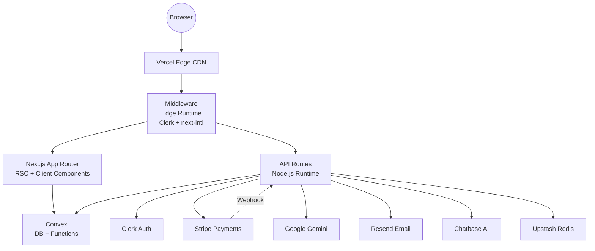

# System Architecture — almstkshf.com

> **Last updated:** April 2026  
> **Stack:** Next.js 15 · Convex · Clerk · Stripe · next-intl · Tailwind CSS v4 · Google Gemini · Chatbase · Resend · Upstash Redis

---

## 1. High-Level Overview

```
Browser → Vercel Edge (CDN) → Next.js Middleware
             ↓
         App Router (RSC + Client Components)
             ↓                        ↓
         Convex (DB + Functions)   Next.js API Routes
             ↓                        ↓
         External Services:  Clerk · Stripe · Gemini · Chatbase · Resend
```

---

## 2. Core Technology Stack

| Layer | Technology | Purpose |
|---|---|---|
| Frontend Framework | Next.js 15.x (App Router) | SSR, RSC, routing |
| Backend-as-a-Service | Convex | Real-time DB, queries, mutations, actions |
| Authentication | Clerk (`@clerk/nextjs`) | Identity, session management |
| Payments | Stripe | Subscriptions, one-time payments |
| AI / Analysis | Google Gemini Pro | Media sentiment analysis, smart assist |
| Email | Resend | Contact forms, notifications |
| AI Chat Support | Chatbase | Embedded chatbot widget |
| Rate Limiting / Cache | Upstash Redis | API rate limiting, search caching |
| Internationalisation | next-intl v4 | Arabic (ar) / English (en) bilingual routing |
| Styling | Tailwind CSS v4 + Vanilla CSS | UI |
| Animations | Framer Motion | Micro-animations |
| 3D / Visuals | Three.js + React Three Fiber | Hero globe, 3D elements |
| PDF/Excel | jsPDF, ExcelJS | Report generation |
| Deployment | Vercel | Production hosting |

---

## 3. Middleware (`src/middleware.ts`)

Runs on **Vercel Edge Runtime**. Two concerns composed:

1. **`clerkMiddleware`** — wraps everything to inject auth context.
2. **`createMiddleware(routing)`** — next-intl locale detection & redirection.

**Logic flow:**
1. If path starts with `/api` → skip i18n, pass through.
2. If route is NOT in `isPublicRoute` matcher → call `auth.protect()` (redirect to sign-in).
3. For all other requests → apply intl middleware.

**Public routes** (no auth required):
- `/`, `/(en|ar)`, contact, pricing, case-studies, lexcora, styling-assistant, behind-the-scene, technical-solutions, media-monitoring, sign-in, sign-up, `/api/stripe/webhook`, `/api/stripe/checkout`, `/api/chatbase/token`, `/api/webhooks/*`, `/monitoring/*`

> ⚠️ **Critical Rule:** Never call Convex functions or import Node.js modules (`fs`, `process`, `crypto`) inside middleware. It runs in Edge Runtime only.

---

## 4. App Router — Route Map

```
/[locale]/                     → Landing page (HomeClient.tsx)
/[locale]/dashboard            → Main analytics dashboard (protected)
  /dashboard/page.tsx          → Renders tabs: Standard | Deep | OSINT | Press
/[locale]/case-studies         → Case studies listing
/[locale]/contact              → Contact form
/[locale]/pricing              → Pricing & Stripe checkout
/[locale]/payment              → Payment success/cancel pages
/[locale]/media-monitoring/    → Media monitoring feature pages
  /tv-radio                    → TV/Radio broadcast monitoring
  /press                       → Press publication monitoring
  /central-media-repository    → Digital asset library
  /media-pulse                 → Analytics detail page
/[locale]/technical-solutions/ → KYC, API Integration hub pages
  /kyc-compliance              → KYC verification UI
  /integration-hub             → API integration docs
  /crisis-management           → Crisis management plans
/[locale]/behind-the-scene     → Team page
/[locale]/privacy              → Privacy policy
/[locale]/terms                → Terms of service

// API Routes (no locale prefix)
/api/stripe/checkout           → Create Stripe checkout session (POST)
/api/stripe/webhook            → Stripe webhook receiver (POST, public)
/api/chatbase/token            → Generate Chatbase JWT for user identity
/api/monitor                   → News monitoring trigger (POST)
/api/sentiment                 → Sentiment analysis (POST)
/api/search                    → Upstash-backed search API
```

---

## 5. Convex Backend

### 5.1 Database Schema (`convex/schema.ts`)

| Table | Purpose | Key Indexes |
|---|---|---|
| `media_monitoring_articles` | All media articles (standard + deep) | `by_date`, pagination |
| `ingestion_runs_deep` | Deep web scan run logs | `by_started_at` |
| `app_settings` | Singleton app config (API keys, defaults) | type = "global" |
| `user_settings` | Per-user: KYC status, Phyllo ID, prefs | `by_user_id` |
| `userSettings` | Per-user: Gemini key, subscription, trial | `by_userId` |
| `crisis_plans` | Crisis management plan entries | — |
| `case_studies` | Case study content | — |
| `contact_submissions` | Contact form submissions | — |
| `free_analyses` | Free AI media analysis results | — |
| `waitlist` | Styling assistant waitlist | `by_email` |
| `osint_results` | OSINT investigation history | `by_created_at`, `by_user_id` |
| `payments` | Stripe one-time payment records | `by_session_id`, `by_user_id` |
| `subscriptions` | Stripe subscription records | `by_user_id`, `by_subscription_id` |
| `notifications` | In-app alerts, deep scans, high-risk detection, billing | `by_userId` |

> ⚠️ **Note:** `user_settings` and `userSettings` are **two separate tables** with overlapping but different fields. `userSettings` is the subscription-aware table. `user_settings` holds KYC status and Phyllo integration.

### 5.2 Convex Function Files

| File | Runtime | Exports |
|---|---|---|
| `monitoring.ts` | Default | Queries/mutations for `media_monitoring_articles` |
| `monitoringAction.ts` | Node.js Action | Fetches from NewsData, NewsAPI, GNews, RSS, headless |
| `deepSources.ts` | Node.js Action | Deep web / World News API scanning |
| `osint.ts` | Node.js Action | Email, domain, IP, username, phone lookups |
| `osintDb.ts` | Default | OSINT results CRUD |
| `settings.ts` | Default | App settings (global config) |
| `userSettings.ts` | Default | Per-user settings CRUD |
| `payments.ts` | Default | Payment & subscription record mutations |
| `contact.ts` | Node.js Action | Contact form email via Resend |
| `waitlist.ts` | Default | Waitlist entries |
| `analyses.ts` | Default | Free sentiment analysis results |
| `case_studies.ts` | Default | Case study data |
| `media.ts` | Default | Media monitoring helper queries |
| `init.ts` | Default | Database seeding / initialization |
| `crons.ts` | Scheduler | Cron jobs (e.g. auto-sync of press wires) |
| `queries.ts` | Default | Shared general queries |
| `phyllo.ts` | Node.js Action | Phyllo SDK integration |
| `auth.config.ts` | — | Convex auth config (Clerk provider) |

---

## 6. Component Map

### Root-level components (`src/components/`)
| Component | Used In | Purpose |
|---|---|---|
| `Navbar.tsx` | Every page | Full bilingual navigation, auth state, command menu |
| `Footer.tsx` | Every page | Footer links, legal, address |
| `HomeClient.tsx` | `/` | Landing page (hero, AI demo, clients, FAQ) |
| `FreeInsightTool.tsx` | Landing | Free AI sentiment demo widget |
| `SentimentTracker.tsx` | Dashboard | Live sentiment chart |
| `NewsGenerator.tsx` | Dashboard | Monitoring form UI |
| `OsintTab.tsx` | Dashboard | OSINT engine + external resource directory |
| `DeepStatusPanel.tsx` | Dashboard | Deep web scan config + run history |
| `PressReleasePanel.tsx` | Dashboard | PR wire sync |
| `LexcoraClient.tsx` | `/case-studies/lexcora` | Lexcora ERP showcase |
| `StylingAssistantClient.tsx` | `/case-studies/styling-assistant` | VA showcase + waitlist |
| `SmartMediaAssistantClient.tsx` | Media monitoring pages | Smart assistant embed |
| `RssFeeder.tsx` | Dashboard (Live Feed) | Premium RSS monitor with modal details and direct ingestion |
| `CrisisManagementClient.tsx` | `/technical-solutions/crisis-management` | Crisis plan cards |
| `KYCVerification.tsx` | `/technical-solutions/kyc-compliance` | KYC upload UI |
| `IntegrationHub.tsx` | `/technical-solutions/integration-hub` | API integration docs |
| `ChatbaseWidget.tsx` | Layout | Embedded Chatbase chatbot |
| `CommandMenu.tsx` | Navbar | ⌘K global command palette |
| `ContactForm.tsx` | `/contact` | Contact form with Resend |
| `CheckoutButton.tsx` | Pricing | Stripe checkout trigger |
| `PhylloConnect.tsx` | (social auth feature) | Phyllo SDK widget |
| `ThemeProvider.tsx` | Layout | Dark/light mode provider |
| `ThemeToggle.tsx` | Navbar | Theme switch button |
| `ReportLibrary.tsx` | Media Monitoring | Report card grid view |
| `ReportsChart.tsx` | Media Monitoring | Analytics charts |
| `NotificationBell.tsx` | Navbar | UI panel for reading/dismissing in-app alerts |

### Media Pulse components (`src/components/media-pulse/`)

All dashboard-specific data visualisation and table components live here.

| Component | Purpose |
|---|---|
| `DashboardGrid.tsx` | Main KPI orchestrator — layouts all analytics cards and the geographic reach sidebar |
| `ArticleTable.tsx` | Coverage log table with sentiment badges, source filters, and delete actions |
| `ManualEntryModal.tsx` | Manual article CRUD form (modal) |
| `ArticlesTrendChart.tsx` | Area chart — article volume over time. Resolves CSS vars at runtime via `getCSSVar()` |
| `SentimentDonutChart.tsx` | Half-donut gauge showing positive/neutral/negative split with NSS index overlay |
| `EmotionRadarChart.tsx` | Radar chart for emotion distribution across articles |

> ⚠️ **Color Resolution Rule:** All chart components that use Recharts or SVG must resolve CSS variables at runtime using `getComputedStyle(document.documentElement).getPropertyValue('--var-name')`. Direct `var(--token)` or `hsl(var(--token))` strings are **not valid** in SVG fill/stroke attributes and will render as black or transparent.

### Utility library (`src/lib/`)
| File | Purpose |
|---|---|
| `gemini.ts` | Google Gemini API wrapper |
| `gemini-key-resolver.ts` | BYOK vs system key resolver |
| `stripe.ts` | Stripe server SDK |
| `stripe-client.ts` | Stripe browser SDK |
| `stripe-products.ts` | Product/price ID constants |
| `rateLimit.ts` | Upstash Redis rate limiter |
| `upstash.ts` | Upstash client |
| `metrics.ts` | AVE and reach calculation helpers |
| `navigation.ts` | next-intl navigation helpers |

---

## 7. Internationalisation (i18n)

- **Locales:** `ar` (Arabic, RTL, default), `en` (English)
- **Routing:** All pages live under `/[locale]/…`
- **Message files:** `messages/ar.json`, `messages/en.json`
- **Config:** `src/i18n/config.ts` — defines supported locales + routing strategy
- **Namespaces in use:**

| Namespace | Used By |
|---|---|
| `Navigation` | `Navbar.tsx` |
| `Common` | Shared across many components |
| `Dashboard` | Dashboard page and filter UI |
| `ArticleTable` | `ArticleTable.tsx` |
| `ManualEntry` | `ManualEntryModal.tsx` |
| `DeepSources` | `DeepStatusPanel.tsx` |
| `SentimentTracker` | `SentimentTracker.tsx` |
| `NewsGenerator` | `NewsGenerator.tsx` |
| `OsintTab` | `OsintTab.tsx` |
| `Osint` | `OsintTab.tsx` (resource directory) |
| `PressReleasePanel` | `PressReleasePanel.tsx` |
| `FreeTool` | `FreeInsightTool.tsx` |
| `Settings` | Settings page |
| `MediaPulseDetail` | Media pulse detail page |
| `MediaMonitoring` | TV/Radio, Press monitoring pages |
| `CrisisManagementDetail` | Crisis management page |
| `TechnicalSolutions` | KYC and API integration pages |
| `CaseStudies` | Lexcora and styling pages |
| `Footer` | `Footer.tsx` |
| `Legal` | Privacy + Terms pages |
| `Error` / `NotFound` | Error pages |
| `Pricing` | Pricing page |

---

## 8. Authentication & Role Model

- Auth provider: **Clerk**
- All protected routes guard via `auth.protect()` in middleware
- User identity passed to Convex as JWT token (Clerk as Convex auth provider — see `convex/auth.config.ts`)
- **Subscription tiers** (tracked in `userSettings` table):
  - `isTrialActive + trialEndsAt` → 7-day free trial
  - `isSubscribed` → paid subscriber
  - No subscription → limited/free access

---

## 9. Payment Flow

```
User clicks "Subscribe"
  → POST /api/stripe/checkout → creates Stripe Checkout Session
  → Redirect to Stripe
  → User pays
  → Stripe POST /api/stripe/webhook (checkout.session.completed)
  → Webhook calls internal Convex mutation
  → Updates payments + subscriptions tables
```

**Subscription webhook events handled:**
- `checkout.session.completed` → record payment
- `customer.subscription.updated` → update status
- `customer.subscription.deleted` → cancel subscription
- `checkout.session.async_payment_failed` → dispatch billing notification
- `invoice.payment_failed` → dispatch billing notification

---

## 10. Monitoring Data Flow

```
User sets keyword + countries + languages
  → NewsGenerator component
  → POST /api/monitor
  → Calls monitoringAction (Convex Node.js Action)
  → Fetches from: NewsData.io, NewsAPI.org, GNews.io, World News API
  → Fetches from RSS Feeds: Premium regional publishers (WAM, Sky News Arabia, Al Arabiya, Asharq Al-Awsat, BBC Arabic, Gulf Today, Khaleej Times, Gulf News, Zawya, AETOSWire, etc.) via custom localized engine (`rss-engine.ts`)
  → RSS Engine features: Image extraction, redirect following, multilingual normalization (EN/AR), and country detection.
  → For each article: dedup check → sentiment analysis (Gemini) → store in media_monitoring_articles
  → Dashboard re-renders via Convex real-time subscription
```

---

## 11. Critical Patterns & Rules

1. **Convex inside Client Components only** — never call Convex from middleware or server components directly.
2. **Gemini key priority:** BYOK (user's own key from `userSettings`) > system key from `app_settings` > env var. Resolved in `gemini-key-resolver.ts`.
3. **All API routes are Node.js runtime** — middleware is Edge Runtime.
4. **useMemo / useState** — always declare all state variables referenced in dependency arrays.
5. **Translation keys** — always add new keys to BOTH `ar.json` AND `en.json` simultaneously to prevent `MISSING_MESSAGE` errors.
6. **Deep web & OSINT** — these run as Convex `action` (Node.js runtime), not queries/mutations.
7. **Chart color resolution** — do NOT use `hsl(var(--token))` in Recharts or SVG attributes. CSS variables in this project store hex values (e.g. `#2563EB`), so `hsl(#hex)` is invalid. Always call `getComputedStyle(document.documentElement).getPropertyValue('--token').trim()` at component mount time and pass the resolved string to chart props. Status tokens (`--status-success`, etc.) store bare HSL components (e.g. `158 64% 52%`) and must be wrapped: `` `hsl(${resolvedValue})` ``.
8. **Button system in `dashboard/page.tsx`** — this file uses native `<button>` elements exclusively (the `Button` component import was removed). All buttons share `h-9` height, `text-xs font-semibold`, `rounded-lg`, and `border border-border`. Do not re-introduce the `Button` component import; maintain the native system for consistency.

---

## 12. Infrastructure Diagram


