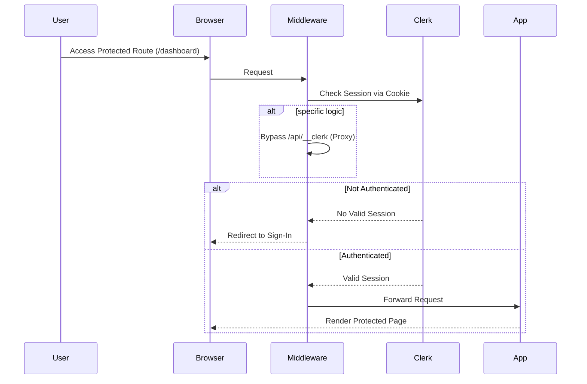
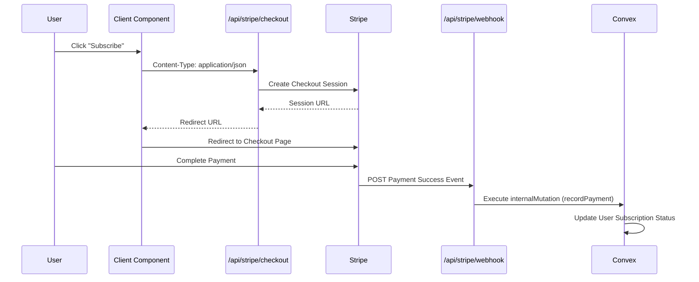
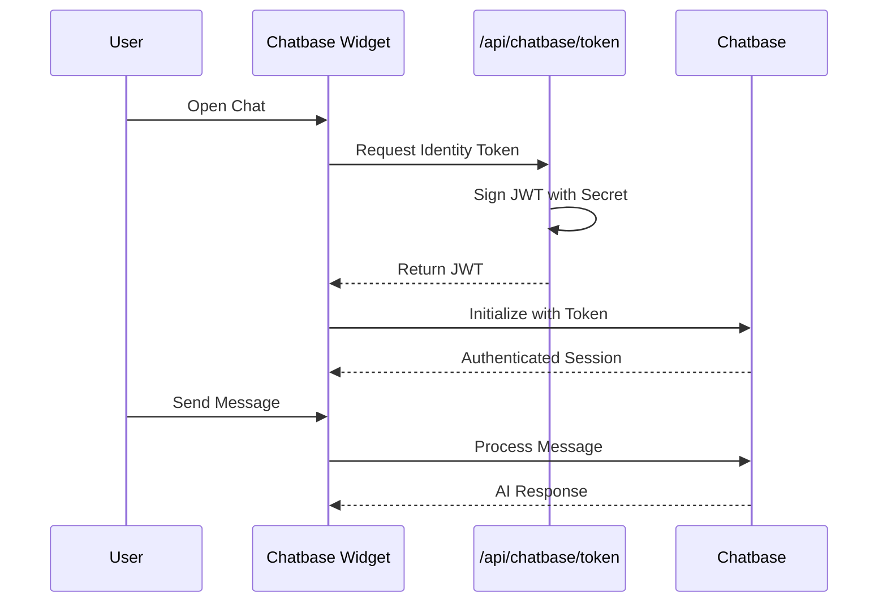

# System Architecture

## Overview
The architecture is built on top of **Next.js 15 (App Router)** and utilizes a serverless-first approach with **Convex** as the backend-as-a-service. Authentication is handled by **Clerk**, payments by **Stripe**, and AI capabilities by **Google Gemini** and **Chatbase**.

---

## 🏗️ High-Level Infrastructure Diagram

```mermaid
graph TD
    %% Define Styles
    classDef client fill:#e1f5fe,stroke:#01579b,stroke-width:2px;
    classDef next fill:#fff3e0,stroke:#ff6f00,stroke-width:2px;
    classDef external fill:#f3e5f5,stroke:#7b1fa2,stroke-width:2px;
    classDef db fill:#e8f5e9,stroke:#2e7d32,stroke-width:2px;

    Client((Client Browser)):::client
    edgedge[Vercel Edge Network]:::next
    
    subgraph "Next.js Application (Vercel)"
        Middleware[Middleware.ts<br/>(Auth, i18n, CSP)]:::next
        ServerComp[Server Components<br/>(RSC)]:::next
        ClientComp[Client Components<br/>(Interactive UI)]:::next
        API[API Routes / Server Actions]:::next
    end

    subgraph "Backend Services (Convex)"
        Convex[Convex Functions<br/>(Query/Mutation/Action)]:::db
        Database[(Convex Database)]:::db
        Scheduler[Convex Scheduler]:::db
    end

    subgraph "External Integrations"
        Clerk[Clerk Auth<br/>(Identity Provider)]:::external
        Stripe[Stripe Payments<br/>(Checkout/Webhooks)]:::external
        Gemini[Google Gemini AI<br/>(Analysis/Generation)]:::external
        Chatbase[Chatbase AI<br/>(Customer Support)]:::external
        Resend[Resend Email<br/>(Notifications)]:::external
    end

    %% Data Flow
    Client -->|HTTPS Request| edgedge
    edgedge --> Middleware
    Middleware -->|Routing/ rewriting| ServerComp
    Middleware -->|API Request| API

    ServerComp -->|Fetch Data| Convex
    ServerComp -->|Generate Content| Gemini
    
    ClientComp -->|Real-time Subscription| Convex
    ClientComp -->|User Interaction| API
    
    API -->|Auth Verification| Clerk
    API -->|Payment Intent| Stripe
    API -->|Chat Token| Chatbase
    API -->|Send Email| Resend
    
    Convex -->|Update/Query| Database
    Convex -->|Scheduled Tasks| Scheduler

    Stripe -.->|Webhook Event| API
```

---

## 🔐 Authentication Flow (Clerk + Middleware)



---

## 💳 Payment Flow (Stripe + Convex)



---

## 🤖 Chatbot Flow (Chatbase + JWT)


